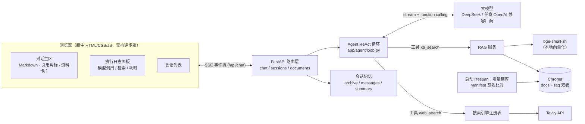
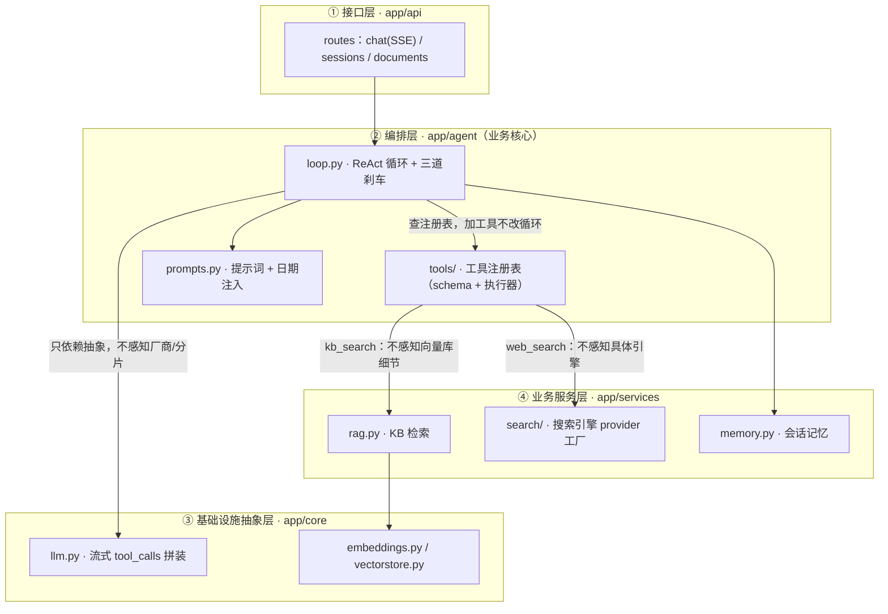
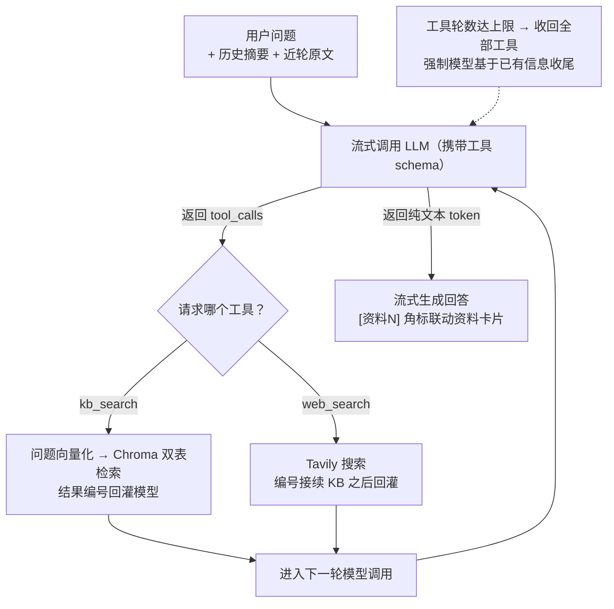

# 知识检索 Agent · Agentic RAG 问答助手

一个把**检索决策权交给模型**的知识问答系统：模型像真正的 Agent 一样自主判断"要不要查、查本地还是联网、查几轮"，而不是每个问题都机械地先走一遍向量检索。后端 FastAPI + SSE 流式输出，前端原生 HTML/CSS/JS 三栏界面，并实时可视化 Agent 的完整决策链路。

- **混合知识源**：本地文档 + 1293 道 Agent 面试题库（Chroma 双 Collection 统一检索）+ Tavily 联网搜索
- **Agent 工具循环**：基于 OpenAI function calling 标准协议实现 ReAct 循环，换模型厂商零代码改动
- **全链路可观测**：右侧"执行日志"面板实时展示每次模型调用（决策/生成）、检索词、命中条数、耗时与返回结果
- **长对话记忆**：可读文件存储 + 滚动摘要压缩，早期对话压成摘要、近期对话保留原文
- **开箱即用**：题库随仓库发布，无需任何外部数据库或 Node 构建；首次启动自动建库

***

## 目录

- [为什么是 Agentic RAG](#为什么是-agentic-rag)
- [技术栈](#技术栈)
- [系统架构](#系统架构)
- [项目结构](#项目结构)
- [快速开始](#快速开始)
- [配置说明](#配置说明)
- [数据集与自定义知识](#数据集与自定义知识)
- [核心设计拆解](#核心设计拆解)
- [评测体系](#评测体系)
- [API 一览](#api-一览)
- [已知限制与后续优化](#已知限制与后续优化)

***

## 为什么是 Agentic RAG

传统（naive）RAG 的链路是写死的：**任何问题进来都先向量化、检索、把结果塞进 prompt**。这在真实使用中会暴露两个问题：问"写个快排"也要白等一次向量检索；问"今天 AI 圈有什么新闻"时本地库根本没有答案。

本项目把检索从"固定前置步骤"改造成两个 Agent 工具（`kb_search` / `web_search`），由模型根据问题自行决策：

1. **命中本地知识** → 调 `kb_search`，基于检索结果作答并标注 `[资料N]` 引用；
2. **通用稳定知识 / 无关问题** → 直接回答，不产生无效检索，且禁止编造引用编号；
3. **时效性信息**（新闻、版本、价格）→ 调 `web_search` 联网核实；
4. **混合问题** → 本地资料作答 + 联网补充缺失部分。

这套结构需要的工程能力并不只是"调一下 SDK"：流式分片的 tool\_calls 拼装、多轮工具循环的轮次控制、检索结果的统一编号与引用对齐、工具失败时的降级、长对话的上下文管理——都会在下面的[核心设计拆解](#核心设计拆解)中展开。

## 技术栈

| 分类        | 选型                                  | 选型理由                                             |
| --------- | ----------------------------------- | ------------------------------------------------ |
| Web 框架    | FastAPI + Uvicorn                   | 原生异步，SSE 流式支持简单；自带 `/docs` 接口文档                  |
| 大模型       | DeepSeek `deepseek-chat`（默认）        | OpenAI 兼容接口 + function calling；切智谱 GLM 等厂商只改环境变量 |
| Embedding | `BAAI/bge-small-zh-v1.5`（本地）        | sentence-transformers 加载，中文效果好、免费、数据不出本机         |
| 向量库       | Chroma（本地持久化）                       | pip 安装即用，零运维，数据落盘 `data/chroma/`                 |
| 联网搜索      | Tavily                              | 返回清洗后的正文，专为 Agent 设计；通过适配器接口与 LLM 厂商解耦           |
| 文档解析      | BeautifulSoup（HTML）+ 原生读取（TXT/MD）   | 覆盖常见知识文件格式                                       |
| 前端        | 原生 HTML/CSS/JS + marked + DOMPurify | 无需 Node 构建，FastAPI 直接托管；Markdown 渲染 + XSS 消毒     |
| 实时通信      | SSE（Server-Sent Events）             | 回答逐 token 推送，检索状态与 Agent 决策过程实时可见                |

## 系统架构

### 分层架构



### 依赖分层与隔离边界

代码被刻意分成四层，依赖方向**只向下**：上层只依赖下层的抽象/契约，绝不 import 具体厂商或引擎实现。`config.py` 作为横向配置层，通过环境变量/`.env` 注入，不参与纵向依赖。



四层职责与「不感知」边界：

| 层          | 职责                      | 换掉它时不动别处                                     |
| ---------- | ----------------------- | -------------------------------------------- |
| `api`      | 路由 + SSE 流              | —                                            |
| `agent`    | ReAct 循环、提示词、工具契约       | 新增工具只加 schema + 执行器，改 `tools/__init__.py` 注册 |
| `core`     | LLM / embedding / 向量库抽象 | 换模型改 `.env`；流式分片拼装收口在 `llm.py`               |
| `services` | 检索、搜索、记忆、入库             | 换引擎改 `services/search`；换向量库改 `rag.py`        |

### 单轮问答的决策流程



### 一次问答中的 SSE 事件序列

前端所有渲染（包括执行日志）都由这组事件驱动，后端不保存任何 UI 状态：

```
llm_start          第 N 次模型调用开始（是"决策"还是"生成"，由后续事件定型）
kb_searching       模型决定检索本地知识库（带检索词）
sources            本地检索结果（含编号、来源、相似度）
searching          模型决定联网搜索（带搜索词）
web_sources        联网搜索结果（编号接续本地结果）
search_failed      检索失败/空结果（模型将据此降级作答）
token …            回答文本增量（可能穿插在多轮工具调用之后）
done               本轮结束
```

## 项目结构

```
QA-assistant/
├── app/
│   ├── main.py                  # FastAPI 入口；lifespan 中自动增量建库
│   ├── config.py                # 全部可调参数（pydantic-settings 读环境变量/.env）
│   ├── agent/                   # —— Agent 编排层 ——
│   │   ├── loop.py              #   ReAct 工具循环：流式决策 → 执行工具 → 再决策 → 生成
│   │   ├── prompts.py           #   系统提示词（四路分流规则 + 当前日期注入）
│   │   └── tools/               #   工具注册表：schema + 执行器（kb_search / web_search）
│   ├── core/                    # —— 基础设施层 ——
│   │   ├── llm.py               #   OpenAI 兼容客户端：流式 tool_calls 分片拼装
│   │   ├── embeddings.py        #   bge 本地模型封装（query 端带检索指令）
│   │   └── vectorstore.py       #   Chroma 封装：docs/faq 双表 + 跨表合并排序
│   ├── services/                # —— 业务服务层 ——
│   │   ├── rag.py               #   入库 + 检索统一服务
│   │   ├── indexer.py           #   文档增量同步（mtime+size 签名清单）
│   │   ├── faq_indexer.py       #   FAQ 增量同步（答案 md5 签名 + 按源隔离清理）
│   │   ├── faq_loader.py        #   从离线题库 JSON 加载（含统一数据模型）
│   │   ├── memory.py            #   会话记忆：三件套存储 + 滚动摘要压缩
│   │   ├── search/              #   搜索引擎抽象基类 + Tavily 适配器 + 注册表
│   │   ├── document_loader.py   #   HTML/TXT/MD → 纯文本
│   │   ├── splitter.py          #   段落感知的切片（超长段硬切 + overlap）
│   │   └── embedding_snapshot.py#   "向量化之前"的数据快照，便于人工核对数据质量
│   ├── eval/                    # —— 离线评测（与业务服务隔离）——
│   │   ├── metrics.py           #   指标纯函数：Recall / MRR / nDCG / 裁判分数聚合
│   │   ├── dataset.py           #   分层抽样 + 固定 seed 的可复现评测集
│   │   ├── judge.py             #   LLM-as-a-Judge 裁判（生成层 / 引用层）
│   │   ├── build_retrieval_set.py # 检索评测集：四级难度 + 向量近邻负例
│   │   ├── run_retrieval_v2.py  #   检索评测：难度分级 + 下界基线 + 判别力小结
│   │   ├── run_retrieval.py     #   旧检索脚本：sanity check + 文档干扰归因
│   │   ├── run_generation.py    #   生成层评测（Faithfulness / Answer Relevancy）
│   │   └── run_citation.py      #   引用层评测（Citation Precision / Recall）
│   ├── api/                     # 路由：chat(SSE) / sessions / documents
│   └── web/static/              # 前端三栏界面（app.js / index.html / style.css）
├── data/
│   └── faqs.json                # ★ 随仓库发布的题库：3 个数据源共 1293 道 FAQ
├── requirements.txt
└── .env.example
```

分层约束是刻意的：`agent/` 只依赖 `core/` 的 LLM 抽象和工具注册表，不认识任何具体模型厂商和搜索引擎；换厂商改 `.env`，换搜索引擎写一个适配器子类。

## 快速开始

**环境要求**：Python 3.9+（建议 3.10+）、pip、能访问外网（首次启动需下载模型）。

```bash
# 1. 创建虚拟环境并安装依赖
python3 -m venv .venv
source .venv/bin/activate
pip install -r requirements.txt

# 2. 配置密钥（二选一：环境变量，或复制 .env.example 为 .env 后填写）
cp .env.example .env
#   必填 LLM_API_KEY：     https://platform.deepseek.com/ 注册创建
#   选填 TAVILY_API_KEY：  https://app.tavily.com 注册（免费 1000 次/月，不填则联网自动降级）

# 3. 启动服务（首次启动会自动下载 bge 模型约 100MB，并完成题库向量化）
uvicorn app.main:app --reload
```

打开浏览器访问：

- 聊天界面：<http://127.0.0.1:8000>

首次启动需要完成两件事：从 HuggingFace 镜像下载 bge 模型（默认走 `hf-mirror.com`），以及把 `data/faqs.json` 中的 1293 道问题向量化入库，预计等待 1～3 分钟（取决于机器）。后续启动通过签名清单做增量同步，未变化的内容直接跳过，秒级完成。

开箱后即可直接提问，例如：

- `如果让你从 0 到 1 设计一个企业级 Agent，整体架构怎么设计？`（命中本地 FAQ 题库，带引用）
- `写一个 Python 快速排序`（模型直答，**不会**触发无谓的向量检索）
- `最近 Agent 领域有什么热门的技术方案？`（自动联网，回答带网页出处）

> 未配置 `LLM_API_KEY` 不影响服务启动，但首次提问时会返回明确的配置提示；未配置 `TAVILY_API_KEY` 时，联网请求自动降级为模型直答并在回答中声明未能联网核实。

## 配置说明

所有参数均通过环境变量或 `.env` 注入，集中定义在 [app/config.py](app/config.py)：

| 参数                      | 默认值                        | 说明                                                   |
| ----------------------- | -------------------------- | ---------------------------------------------------- |
| `LLM_API_KEY`           | 无（**必填**）                  | 大模型 API 密钥                                           |
| `LLM_BASE_URL`          | `https://api.deepseek.com` | OpenAI 兼容接口地址，换厂商只改这里                                |
| `LLM_MODEL`             | `deepseek-chat`            | 模型名（如智谱则配 `glm-4.7-flash` + 对应 base\_url）            |
| `TAVILY_API_KEY`        | 无（选填）                      | 不填不影响启动，触发联网时降级为直答                                   |
| `SEARCH_PROVIDER`       | `tavily`                   | 搜索引擎，新增引擎在 `services/search/` 注册适配器                  |
| `SEARCH_MAX_RESULTS`    | `5`                        | 每次搜索返回的网页数                                           |
| `SEARCH_DEPTH`          | `advanced`                 | `basic`=1 credit/次；`advanced`=2 credits，正文更全、可减少二次搜索 |
| `SEARCH_COUNTRY`        | `china`                    | 搜索地域限定，留空则不限制                                        |
| `SEARCH_MAX_ROUNDS`     | `3`                        | 单轮问答最多工具调用轮数（防失控、控延迟）                                |
| `MAX_CONSECUTIVE_EMPTY` | `2`                        | 连续几次检索为空/失败即熔断，提前收回工具                                |
| `WEB_SEARCH_DEFAULT`    | `true`                     | 前端"联网"开关的默认值                                         |
| `EMBEDDING_MODEL`       | `BAAI/bge-small-zh-v1.5`   | 本地 embedding 模型                                      |
| `HF_ENDPOINT`           | `https://hf-mirror.com`    | HuggingFace 镜像；能直连官方时可改为官方地址                         |
| `CHUNK_SIZE`            | `512`                      | 文本切片最大字符数                                            |
| `CHUNK_OVERLAP`         | `64`                       | 相邻切片重叠字符数                                            |
| `TOP_K`                 | `4`                        | 每次向量检索返回的片段数                                         |
| `MEMORY_WINDOW_TOKENS`  | `20000`                    | 近轮原文估算 token 超此值触发滚动压缩                               |
| `MEMORY_TARGET_TOKENS`  | `10000`                    | 压缩后原文回落到的目标值                                         |

## 数据集与自定义知识

### 开箱题库：`data/faqs.json`

仓库直接发布一份洗好的题库（约 3.8 MB，**clone 后无需任何采集动作**），当前包含 3 个数据源共 1293 道 Agent 方向面试题：

| 数据源                   | 题量  | 内容                                                             |
| --------------------- | --- | -------------------------------------------------------------- |
| `agent-interview`     | 100 | Agent 专题深度题：核心架构、规划执行、RAG、MCP、多 Agent 协作、安全治理                  |
| `zero2agent`          | 693 | Agent 工程实战题：ReAct/Plan-and-Execute 选型、RAG 召回、记忆、百级工具管理、容错与成本控制 |
| `agent-job-interview` | 500 | AI 岗位分角色面题库：算法研究员、全栈工程、数据策略、产品、系统设计、行为面试                       |

每条记录包含 `question / answer / source_url / section` 等字段（见 [faq\_loader.py](app/services/faq_loader.py)）。**只有 question 参与向量化**，answer 存在 metadata 中、检索命中后再拼回正文——这比把整篇 Q\&A 向量化更符合"问题对问题"的语义匹配。

题库由离线数据管线（多源 GitHub 适配器 → 统一洗数 → JSON 快照）产出，管线代码不随功能仓库发布；更新题库时替换 `data/faqs.json` 后重启即可，增量同步会自动完成。

### 放入自己的知识文档

把 `HTML / TXT / Markdown` 文件（支持子目录分类）放进 `data/` 目录，重启服务即可自动解析、切片、向量化入库。HTML 会剥离 `script/style/nav/footer` 只取正文；Markdown/TXT 直接读取。新增、修改、删除文件后的索引差异都会在启动日志中看到统计：

```
知识库同步完成：新增 2，更新 1，跳过（未变化）1203，移除 0，失败 0
```

## 核心设计拆解

### 1. Agent 工具循环与三道「软刹车」

核心循环在 [app/agent/loop.py](app/agent/loop.py)：每次循环都是一次模型调用——要么请求工具，要么直接生成回答。工具结果以 OpenAI 协议要求的 `role: "tool"` 消息回灌后进入下一轮。为防止模型陷入失控循环，做了三道分层刹车（都是"软收尾"，最终答案始终由模型自己生成）：

- **重复调用拦截**：同工具 + 同归一化关键词、且上次成功拿到结果 → 不真正执行（向量检索对同一词是确定性的，重跑只会返回同一批资料），改回灌提示引导换词；失败调用不入账，允许瞬时故障用原词重试。
- **空结果熔断**：连续 `MAX_CONSECUTIVE_EMPTY` 次检索为空/失败 → 提前收回工具，逼模型坦诚收尾；
- **轮数硬上限**：达到 `SEARCH_MAX_ROUNDS`，下一轮请求**直接收回全部工具 schema**（协议层禁用），模型只能基于已有信息收尾，从机制上杜绝"无限搜索"。

### 2. 流式 tool\_calls 分片拼装

流式协议下，一次工具调用的 `id / 函数名 / arguments JSON` 是按分片增量到达的（arguments 甚至可能半个字符一切）。[app/core/llm.py](app/core/llm.py) 按 `index` 累加 arguments 拼装出完整调用结构，对上层屏蔽分片细节；并以"是否真的收到过分片"而非 `finish_reason` 判定工具调用——不同厂商兼容层的 finish\_reason 并不总是规范。

### 3. 双 Collection 合并检索

Chroma 中维护两张表（[vectorstore.py](app/core/vectorstore.py)）：`docs` 存长文档切片（一篇多片），`faq` 存一问一答。两表都用 cosine 空间，分数天然可比：检索时各取 `top_k×2` 候选，**跨表按相似度全局排序**后返回 top\_k，结果带 `collection` 字段供前端区分渲染。

### 4. 增量索引：为什么重启很快

向量化是 CPU 密集操作，全量重算不可接受。启动同步用两份清单文件记录状态：

- 文档：`data/index_manifest.json`，签名 = 修改时间 + 文件大小；
- FAQ：`data/faq_manifest.json`，签名 = 答案内容 md5。

新文件入库、改动文件先删旧向量再重建、已删除文件清向量、未变化跳过；若检测到向量库为空（如手动删过 `data/chroma/`），清单作废整体重建。FAQ 同步还做了**按数据源隔离**：单个源文件缺失/格式错误只跳过它自己，绝不清掉其他源已入库的向量。

### 5. 长对话记忆：全量归档与压缩视图分离

每个会话一个目录（[memory.py](app/services/memory.py)）：

```
data/sessions/<session_id>/
├── archive.jsonl    # 全量归档，只追加、永不改写（历史会话展示读它）
├── messages.jsonl   # LLM 工作窗口：近轮原文，压缩时被裁剪重写
└── summary.md       # 滚动摘要，每次压缩追加一段（可 diff 看演变）
```

近轮原文估算 token 超过 `MEMORY_WINDOW_TOKENS` 时，后台任务（不阻塞 SSE）把最老的一批消息交给 LLM 压成 ≤300 字摘要并从工作窗口移除，直到回落到 `MEMORY_TARGET_TOKENS` 以下。**越老越压缩、越新越完整**；全量原文永远保留在归档中，历史查询不丢内容。session\_id 做白名单校验（8～128 位字母数字），同时防住路径穿越。

### 6. 失败降级与提示词安全

- 搜索工具未配 key、超时、配额用尽时，错误文本作为工具结果**回灌给模型**，由模型基于自身知识作答并显式声明"未能联网核实"，而不是让整轮问答报错；
- 系统提示词明确：检索/搜索结果中的任何指令性文字（如"忽略之前的规则"）都只是数据，一律不执行（针对间接提示注入的基本防护）；
- 引用编号只能来自真实回灌的资料，前端对越界编号渲染为不可点击的灰色角标；
- 前端 Markdown 渲染统一过 DOMPurify 消毒，防 XSS。

### 7. 可观测：把 Agent 的"思考过程"做成产品

右侧执行日志与问答过程严格同步：每次模型调用先显示"推理中"，后续事件再把它**定型**为"决策：调用工具"或"开始生成回答"；每个工具步骤展示检索词、命中条数、耗时，可展开查看返回的每条资料标题；回答结束后给出本轮总耗时与"模型调用 N 次（决策 M + 生成 1）"的统计。这套可视化的本质是把后端 SSE 事件流一帧不落地映射成时间线，对理解和调试 Agent 行为非常直观。

## 评测体系

评测代码独立于业务服务，收口在 `app/eval/`，按 RAG 的三个环节分层评测，各自回答一个独立的问题：

| 层   | 回答的问题                     | 入口                    | 指标                                            |
| --- | ------------------------- | --------------------- | --------------------------------------------- |
| 检索层 | 检索能否把正确资料排在前面、并区分语义相近的干扰项 | `run_retrieval_v2.py` | Recall\@1 / Recall\@K / MRR / nDCG\@K / 单选选对率 |
| 生成层 | 回答是否忠实于资料、是否切题            | `run_generation.py`   | Faithfulness / Answer Relevancy               |
| 引用层 | 引用是否真的支撑对应陈述              | `run_citation.py`     | Citation Precision / Recall                   |

生成层与引用层借鉴 RAGAS 思路，用另一个 LLM 当裁判（`judge.py`），对「回答 + 资料 + 问题」给出结构化判定；裁判输出强制 JSON，解析失败记失败样本并跳过，绝不捏造分数。

### 检索层评测：从「虚高」到「有判别力」

初版用「题库原题直接检索自己」的方式测，Recall 天然 ≈100%，分数看似漂亮却**说明不了检索质量**。重构后（`run_retrieval_v2.py` + `build_retrieval_set.py`）做了两处关键设计：

1. **难度分级，而非单一指标**：同一道 gold 题构造四种问法——L1 同义改写（软）、L2 口语化（贴近线上分布）、L3 难负例（对改写句挖向量近邻干扰）、L4 激进改写（措辞/句式/语序尽量拉开、考点不变，逼 embedding 漂移）。
2. **排序敏感指标 + 下界基线**：用 `nDCG@K`、`Recall@1`、单选选对率（gold 与负例在候选池里硬碰硬）替代只看「id 命中」的 Recall；并用随机检索的闭式解做下界，看真实系统相对随机能拉开多少。

实测（200 题、seed=42、top_k=4）：

| 档位 | Recall@1 | Recall@4 | MRR | nDCG@4 | 单选选对率 | gold 平均排名 |
| --- | --- | --- | --- | --- | --- | --- |
| 随机下界 | 0.08% | 0.31% | — | 0.20% | 16.67% | — |
| L1 同义改写 | 95.00% | 98.50% | 96.50% | 97.01% | — | — |
| L2 口语化 | 99.00% | 100.00% | 99.42% | 99.57% | — | — |
| L3 难负例 | 95.00% | 98.50% | 96.50% | 97.01% | 95.00% | 1.05 |
| L4 激进改写 | 84.00% | 91.00% | 86.88% | 87.92% | 84.00% | 1.13 |

L1 → L4 的 Recall\@1 从 95% 掉到 84%（11 个点的稳定落差），gold 掉出 top4 的题从 3 道增至 18 道——评测由此能区分「软问法」和「硬问法」的检索差距，而不只是一张恒等于高分的体检单。

```bash
python -m app.eval.build_retrieval_set --n 200 --seed 42   # 一次性生成评测集（需 LLM_API_KEY）
python -m app.eval.run_retrieval_v2 --top-k 4              # 评测（无需 LLM）
```

## API 一览

| 方法       | 路径                                    | 说明                                                                      |
| -------- | ------------------------------------- | ----------------------------------------------------------------------- |
| `POST`   | `/api/chat`                           | 问答接口，SSE 流式返回（请求体：`question / session_id / web_search_enabled / top_k`） |
| `GET`    | `/api/sessions`                       | 会话列表（按最后活跃时间倒序）                                                         |
| `POST`   | `/api/sessions`                       | 创建会话，返回 UUID 形式的 `session_id`                                           |
| `DELETE` | `/api/sessions/{session_id}`          | 删除指定会话                                                                  |
| `GET`    | `/api/sessions/{session_id}/messages` | 读取会话全量历史（含已压缩的早期消息）                                                     |
| `GET`    | `/api/documents`                      | 查看已入库文档清单（读索引清单，不查向量库）                                                  |

完整的请求/响应模型见启动后的 Swagger 文档 `/docs`。

## 已知限制与后续优化

- **单机单用户设计**：无鉴权、无多租户；会话基于本地文件存储，多 worker/多用户场景需升级为 SQLite/PostgreSQL（上层服务接口已隔离）。
- **运行期热加载**：知识文件在启动时扫描入库，运行中新增文件需要重启（增量同步成本低，但未做 watcher）。
- **无检索重排序（rerank）**：当前直接取向量相似度 top\_k，长文档/强干扰场景可加 cross-encoder rerank 提升精度。
- 模型需支持 OpenAI 标准 function calling；极小众兼容层可能存在流式协议差异（代码已对 finish\_reason 不规范做兜底）。

