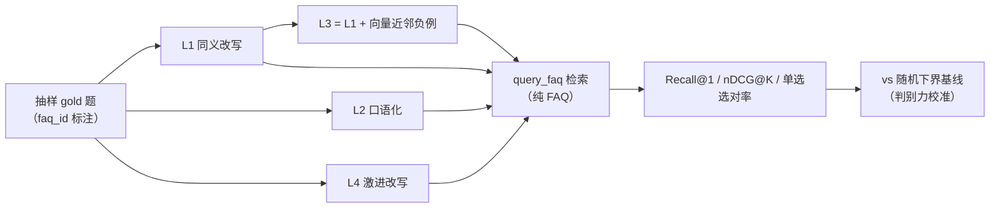

# 评测模块（`app/eval/`）

对 Agentic RAG 的三段链路——**检索 → 生成 → 引用**——做离线量化评测。评测是"用数据说话"的旁路工具：它消费业务模块（`faq_loader` / `embeddings` / `vectorstore`），但绝不反向耦合进运行链路，因此独立放在顶层 `app/eval/`，而不是塞进 `services/`。

三层均已落地：检索层评分零 LLM 成本（评测集构造需一次 LLM 改写）；生成层与引用层走 LLM-as-a-Judge（RAGAS 式）。

***

## 为什么评测要「分层」

业界公认的做法（RAGAS、TruLens 三元组、LLM-as-a-Judge）都指向同一个结论：**RAG 没有单一总分**。一段回答可能检索是准的、生成却是瞎编的，或者生成可信、引用却张冠李戴——混在一起打个分没有任何诊断价值。于是按链路逐层拆开，每层只回答一个问题：

| 层   | 回答的问题               | 业界指标                                          | 评分成本                     | 状态    |
| --- | ------------------- | --------------------------------------------- | ------------------------ | ----- |
| 检索层 | 有没有把对的资料找回来，并排到最前   | Recall\@1 / Recall\@K / MRR / nDCG\@K / 单选选对率 | **零**（本地 embedding）      | ✅ 已实现 |
| 生成层 | 找回来的资料，答得忠不忠实、相关不相关 | Faithfulness / Answer Relevancy               | LLM-as-a-Judge（DeepSeek） | ✅ 已实现 |
| 引用层 | 每一处引用是否对得上出处        | Citation Precision / Recall                   | LLM 抽取比对                 | ✅ 已实现 |

从检索层先做，性价比最高：它是整条链路的**地基**——检索错了，后面生成再强也无从谈起；同时它不花一分钱 token，能先跑通评测方法论与代码骨架。

***

## 检索层是怎么测的

### 一个必须先避开的坑：不能「自己搜自己」

最直觉的测法是「拿题目原文去检索，看它能不能回到自己」——但这是错的。库里存的本就是这题 `question`，向量跟自己是天然接近 1 的相似度，任何及格线的 embedding 都会把自己排第 1，Recall\@1 必然 100%。这违背业界检索评测（BEIR）的核心前提：**query 必须 ≠ 库里的段落**。

更进一步，即便把题目「同义改写」后再检索，召回率依然 95%+ 虚高——因为改写句与原题的向量几乎重合，本质上还是「自己搜自己的孪生变体」。这样的分数**没有判别力**，说明不了检索质量。

所以 v2 把评测目标重定为：**面对措辞变化、口语化、语义近邻干扰，gold 还能否被压到最前；以及措辞越「硬」，检索质量掉多少**。

### 四级难度：同一道 gold 题，四种检索问法

`build_retrieval_set.py` 从 `sample_faqs`（seed 可复现）出发，同一道 gold 题构造四种问法，缓存到 `data/eval_retrieval_set.json`：

| 档位      | 定义                     | 用途                           |
| ------- | ---------------------- | ---------------------------- |
| L1 同义改写 | LLM 改写成措辞不同、考点相同       | 检验能否「透过措辞认出同一题」              |
| L2 口语化  | LLM 改成真实用户提问的口语        | **线上分布鲁棒性**（非难度档，实测召回不低于 L1） |
| L3 难负例  | 复用 L1 改写句 + 向量近邻负例     | 检验 gold 能否压过「语义相近但考点不同」的干扰项  |
| L4 激进改写 | 措辞/句式/语序/信息组织尽量拉开、考点不变 | 逼 embedding 漂移，**判别力的直接来源**  |

难负例纯自动（零 LLM）：对改写问句做 `embed_query`，在全部 1293 道 faq 题面向量里取除 gold 外最相近的 topN 条，它们就是「最像但不应命中」的干扰项。



### 排序敏感指标 + 下界基线

只看「id 命中」的 Recall 分不出「勉强挤进 top4」和「稳稳第 1」；初稿提出的 `precision@K` 在单 gold + 固定 K 场景下会退化为 Recall\@K 的 1/K 缩放、对位置不敏感，已删除。改用：

- **Recall\@1**：第 1 名命中率，排序敏感、最硬；
- **nDCG\@K**：折损累计增益，反映「有没有把相关项排前面」；
- **单选选对率**（L3 / L4）：候选池 = gold + 负例，测 top1 == gold 的比例，让 gold 与近邻干扰项强制正面对决。

再用**随机检索的闭式解**（Recall\@1 = 1/N，单选选对率 = 1/(1+负例数)）做下界，看真实系统相对随机能拉开多少——差距越大，评测越有区分度。

### 指标定义（[metrics.py](metrics.py)）

统一约定：`pred_ids` 是按相似度降序返回的候选 id，`gold_id` 是标注的正确答案 id（本项目每题唯一 `faq_id`）。

| 指标        | 定义                      | 说明                      |
| --------- | ----------------------- | ----------------------- |
| Recall\@1 | top-1 是否为正确答案           | 第 1 名命中率，排序敏感           |
| Recall\@K | top-k 中正确答案被召回的占比       | 单 gold 时命中即 1           |
| Hit\@K    | top-k 是否至少命中一个正确答案      | 单 gold 与 Recall\@K 数值相同 |
| MRR       | 第一个正确结果排名的倒数（第 1 名=1.0） | 未命中计 0                  |
| nDCG\@K   | 折损累计增益                  | 单 gold 时 IDCG=1，对排序敏感   |
| 单选选对率     | 候选池里 top1 == gold 的比例   | 只对含负例的 L3 / L4 计算       |

***

## 目录结构

```
app/eval/
├── __init__.py            # 模块说明：三层评测的设计动机
├── dataset.py             # 从 data/faqs.json 按源分层抽样（最大余数法，seed 固定可复现）
├── metrics.py             # 纯函数指标：检索（recall/hit/mrr/ndcg）+ 生成/引用（faithfulness/relevancy/citation）
├── judge.py               # LLM-as-a-Judge：call_llm / parse_json + 三个裁判函数
├── build_retrieval_set.py # 检索评测集：四级难度 + 向量近邻负例（缓存 eval_retrieval_set.json）
├── run_retrieval_v2.py    # 检索层主评测：难度分级 + 下界基线 + 判别力小结
├── build_queries.py       # 改写 query（缓存 eval_queries.json，供生成/引用层复用）
├── run_generation.py      # 生成层：Faithfulness / Answer Relevancy
└── run_citation.py        # 引用层：Citation Precision / Recall
```

***

## 运行方式

```bash
# 1. 一次性：生成四级难度评测集（需要 LLM_API_KEY，走环境变量或 .env）
python -m app.eval.build_retrieval_set --n 200 --seed 42

# 2. 检索层评测：零评分成本，可反复重跑
python -m app.eval.run_retrieval_v2 --top-k 4
```

评测集生成一次后即与运行时解耦——重跑评测不再调 LLM。缓存文件落在 `data/eval_retrieval_set.json`，属可再生派生数据，随 `data/` 一起被 `.gitignore` 排除。

检索层主对象是 `query_faq`（纯 FAQ 检索，gold 只存在于 FAQ 表）。

***

## 运行效果（检索层，200 题、seed=42、top\_k=4）

### 数据集

| 项    | 值                                                                                 |
| ---- | --------------------------------------------------------------------------------- |
| 题库规模 | 3 数据源共 1293 道 FAQ（agent-interview 100 / zero2agent 693 / agent-job-interview 500） |
| 抽样方式 | 按源分层抽样，最大余数法分配配额，`seed=42` 可复现                                                    |
| 评测集  | 200 道 × 4 级 = 800 条（每道 gold 题 L1/L2/L3/L4 各 1 条）                                  |

### 四级难度实测

| 档位      | Recall\@1 | Recall\@4 | MRR    | nDCG\@4 | 单选选对率  | gold 平均排名 |
| ------- | --------- | --------- | ------ | ------- | ------ | --------- |
| 随机下界    | 0.08%     | 0.31%     | —      | 0.20%   | 16.67% | —         |
| L1 同义改写 | 95.00%    | 98.50%    | 96.50% | 97.01%  | —      | —         |
| L2 口语化  | 99.00%    | 99.21%    | 99.42% | 99.57%  | —      | —         |
| L3 难负例  | 95.00%    | 98.50%    | 96.50% | 97.01%  | 95.00% | 1.05      |
| L4 激进改写 | 84.00%    | 91.00%    | 86.88% | 87.92%  | 84.00% | 1.13      |

> 判别力判读：L1 → L4 的 Recall\@1 从 95% 掉到 84%（11 个点的稳定落差），gold 掉出 top4 的题从 3 道增至 18 道，L4 的 gold 平均排名被扰动到 1.13。评测由此能区分「软问法」和「硬问法」的检索差距，而不只是一张恒等于高分的体检单。L2 口语化反而高于 L1，说明它是「线上分布鲁棒性」档而非难度档。

***

## 生成层：Faithfulness / Answer Relevancy（[run\_generation.py](run_generation.py)）

生成层回答「资料找回来了，答得对不对」。流程：抽样题 → `query_all` 检索 → 让模型**只依据资料**生成带 `[资料N]` 引用的回答 → 裁判打分：

- **Faithfulness（忠实度）**：把回答拆成原子陈述，裁判逐条判定「是否被资料支撑」。`Faithfulness = 被支撑陈述数 / 陈述总数`，专门抓**幻觉**（回答里出现资料没有的内容）。
- **Answer Relevancy（切题度）**：由回答反推 3 个「它能回答的问题」，用 bge 向量算每个与原问题的余弦相似度取均值。回答越偏离原问题，反推出的问题与原问题越不像，得分越低。

```bash
# 复用 build_queries 生成的改写 query（data/eval_queries.json），缺失则退回原题
python -m app.eval.run_generation --n 20   # 每道要多次 LLM 调用，默认 20 道
```

结果缓存到 `data/eval_generation.json`，供引用层复用。实测（n=20、seed=42）：

| 指标               | 结果     |
| ---------------- | ------ |
| Faithfulness     | 99.17% |
| Answer Relevancy | 73.37% |

> 一个先说明白的点：FAQ 的条目文本本身包含答案，所以本层 Faithfulness 基线会偏高——它衡量的是「模型有没有在既有答案上再多编内容」，仍能暴露幻觉回归，但「答错且未引用」这类错误不在本层，交给引用层。

## 引用层：Citation Precision / Recall（[run\_citation.py](run_citation.py)）

引用层回答「每一处 `[资料N]` 都对得上吗」。读上面生成的 `data/eval_generation.json`，逐句判定：

- **Citation Precision**：`带引用的陈述里真的被所引资料支撑的比例`——引用标得对不对；
- **Citation Recall**：`需要事实支撑的陈述里真的给了引用的比例`——该引用的有没有漏标。

```bash
python -m app.eval.run_citation   # 需要在 run_generation 之后
```

实测（n=20）：

| 指标                 | 结果     |
| ------------------ | ------ |
| Citation Precision | 99.00% |
| Citation Recall    | 94.89% |
| Citation F1        | 96.90% |

两层都复用 `dataset.py` 抽样、`metrics.py` 聚合、`judge.py` 裁判，成本按需触发，不与检索层的零成本前提冲突。
